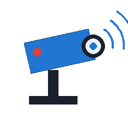
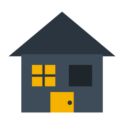
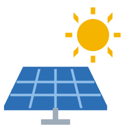

# 🏠 Plugins Jeedom — sMug

**Quinze plugins libres pour Jeedom, écrits en Belgique, sans dépendance à installer — à une exception près, JeeTerm.**

Un dashboard, une console, des caméras, un portier, la détection de présence,
du solaire, MQTT, la météo, les poubelles, les trains, un robot aspirateur,
l'éclairage, les volets, la simulation de présence et un assistant vocal —
chacun dans son dépôt, tous rassemblés ici.

---

## 📖 Ce dépôt

Ce dépôt ne contient aucun code : c'est la **porte d'entrée** vers les plugins
Jeedom publiés sous le compte [`replicatorbe`](https://github.com/replicatorbe).
Chaque plugin vit dans son propre dépôt, avec sa documentation, son changelog et
ses tests. Vous trouverez ici de quoi savoir lequel vous intéresse, et pourquoi.

Un fil conducteur : **résoudre un vrai problème de la maison sans écrire de
scénario**, et ne rien demander de plus que Jeedom — pas de paquet à installer
(JeeTerm mis à part, par nécessité), pas de service tiers imposé, pas de cloud là
où le réseau local suffit.

Et un second, revendiqué : **combler ce qui manque aux Belges dans Jeedom**.
Trois plugins — [Météo Belgique IRM](#-la-belgique-au-quotidien),
[Hygea](#-la-belgique-au-quotidien) et [SNCB/NMBS](#-la-belgique-au-quotidien) —
n'existent que pour ça : les services belges sont rarement couverts par les
plugins existants, quand ils ne sont pas simplement absents.

---

## 🧭 Vue d'ensemble

| | Plugin | En une phrase | Stable | Dépôt |
|:---:|:---|:---|:---:|:---:|
|  | **jeeGlow** | Un second dashboard, moderne et tactile, sans toucher au premier | `0.1` | [↗](https://github.com/replicatorbe/jeedom-plugin-jeeglowbe) |
|  | **JeeTerm** | Un vrai terminal dans Jeedom, comme celui de Home Assistant — ⚠️ seul plugin avec dépendances | `0.2` | [↗](https://github.com/replicatorbe/jeedom-plugin-jeeterm) |
|  | **Dahua NVR** | Les événements de vos caméras Dahua, en temps réel, typés et archivés | `0.6` | [↗](https://github.com/replicatorbe/jeedom-plugin-dahua) |
|  | **Dahua VTO** | On sonne, Jeedom le sait dans la seconde et garde le visage | `0.1` | [↗](https://github.com/replicatorbe/jeedom-plugin-dahuavtobe) |
|  | **Presencium** | Qui est à la maison, pour de bon, et ce que la maison en fait | `1.2` β | [↗](https://github.com/replicatorbe/jeedom-plugin-presencium) |
|  | **Simulation de présence** | La maison rejoue vos vraies soirées pendant que vous êtes ailleurs | `1.0` | [↗](https://github.com/replicatorbe/jeedom-plugin-simulationpresenceintelligentbe) |
|  | **Solplanet** | Votre production solaire en local, sans le cloud du fabricant | `0.2` | [↗](https://github.com/replicatorbe/jeedom-plugin-solplanetbe) |
|  | **MQTT BE** | Donnez l'adresse du broker, vos Shelly arrivent seuls | `0.7` | [↗](https://github.com/replicatorbe/jeedom-plugin-mqttbe) |
|  | **Lampes Soir & Matin** | Les lampes s'allument le soir, s'éteignent le matin. Zéro scénario | `1.3` | [↗](https://github.com/replicatorbe/jeedom-plugin-lampesoirmatinbe) |
|  | **Volets Auto** | Les volets suivent le soleil et la température, pas une heure devinée | `1.2` | [↗](https://github.com/replicatorbe/jeedom-plugin-voletautobe) |
|  | **Dreame** | Vos robots aspirateurs dans vos scénarios, sans passerelle | `0.1` | [↗](https://github.com/replicatorbe/jeedom-plugin-dreamebe) |
|  | **K2000** | Vous parlez à la maison ; elle comprend, agit et rend compte | `0.1` | [↗](https://github.com/replicatorbe/jeedom-plugin-k2000be) |
|  | 🇧🇪 **Météo Belgique IRM** | La météo officielle belge, sans compte ni clé | `0.1` | [↗](https://github.com/replicatorbe/jeedom-plugin-meteobelgiqueirm) |
|  | 🇧🇪 **Hygea** | Le calendrier des poubelles, avec le rappel la veille au soir | `0.5` | [↗](https://github.com/replicatorbe/jeedom-plugin-hygeabe) |
|  | 🇧🇪 **SNCB/NMBS** | Est-ce que je pars maintenant, et sur quelle voie ? | `1.1` | [↗](https://github.com/replicatorbe/jeedom-plugin-sncbnmbs) |

---

## 🖥️ L'interface et l'administration

###  jeeGlow

> *Un second dashboard, moderne et tactile, sans rien changer au premier.*

Jeedom affiche des équipements ; on voudrait qu'il montre une maison. jeeGlow
ajoute un **dashboard parallèle** — le dashboard d'origine, les vues et les
designs restent en place — construit en relisant vos objets, vos équipements et
vos commandes. Il est pensé pour l'écran mural autant que pour le téléphone.

- Rangement **par fonction** — lumières, prises, volets, chauffage, sécurité, caméras, capteurs — déduit des types génériques du cœur, parce qu'un rangement par pièce reste vide de moitié tant que les objets ne sont pas remplis
- Navigation par rail et sous-onglets, qui devient une barre en bas sur téléphone ; une vue **Accueil** dit ce qui tourne dans la maison
- **Panneau de détail** par équipement : toutes les commandes, les courbes d'historique, et le rangement dans une pièce sans quitter le dashboard
- **Le widget du plugin est affiché tel quel** quand son auteur en a écrit un : vignettes d'alerte caméra, plan d'un robot, bulletin météo
- Les valeurs structurées ne sont plus recrachées en JSON : la carte montre le champ le plus lisible, le détail se déplie d'un appui
- **Mode kiosque** : plus de menu ni de barre du haut, retenu par l'appareil, avec retour à l'accueil après inactivité et atténuation de nuit
- Noms raccourcis automatiquement, et un nom à soi par équipement — **sans jamais renommer dans Jeedom**
- Temps réel par le flux d'événements du cœur, droits appliqués équipement par équipement : un profil restreint ne reçoit même pas les boutons qu'il n'a pas le droit d'actionner

**Il ne faut rien** : ni démon, ni dépendance, ni configuration. Le plugin ne
crée aucun équipement et ne modifie rien — il lit.
📦 [`jeedom-plugin-jeeglowbe`](https://github.com/replicatorbe/jeedom-plugin-jeeglowbe)

###  JeeTerm

> *Un vrai terminal dans Jeedom, comme le Terminal de Home Assistant.*

Certaines choses se font plus vite en trois mots dans une console qu'en dix
clics : suivre un journal, relancer un service, regarder l'espace disque, éditer
un fichier. JeeTerm ouvre un **vrai shell** de la machine Jeedom dans le
navigateur — couleurs, raccourcis clavier, `nano`, `vim`, `htop` — relié par un
WebSocket qui passe par l'Apache de Jeedom : rien de plus à ouvrir sur le réseau,
et ça marche en HTTPS comme en HTTP.

- Terminal complet (xterm.js) : recherche, liens cliquables, plein écran, copier-coller même en `http://`, touches spéciales pour tablette et téléphone
- Neuf thèmes, dont **Noir** et **Phosphore vert**, et un effet **écran cathodique** rétro
- Commandes rapides personnalisables, tapées sans être validées : c'est vous qui appuyez sur Entrée
- Bannière d'accueil façon neofetch et raccourcis Jeedom : `jlog`, `jcd`, `jerr`, `jplugins`…
- Session **tmux** persistante en option, compte du shell au choix (`www-data`, `root`…)
- Réservé aux administrateurs, jeton à usage unique de 30 secondes, audit de chaque session, fermeture après inactivité — sans jamais couper une commande qui travaille

> ⚠️ **L'exception de la collection : ce plugin a des dépendances.** Un
> terminal ne peut pas vivre dans une requête PHP : il lui faut un démon qui
> tient le pseudo-terminal ouvert, et un relais WebSocket dans Apache. Son
> installation des dépendances ajoute donc `python3` et `tmux` s'ils manquent,
> active les modules Apache `proxy` et `proxy_wstunnel`, et écrit
> `/etc/apache2/conf-available/jeeterm.conf` — configuration vérifiée avant
> chaque rechargement d'Apache et retirée à la désactivation du plugin. Le
> démon, lui, est en **Python avec la seule bibliothèque standard** : aucun
> `pip`, aucun environnement virtuel.

**Il faut** l'Apache de Jeedom (organisation Debian) et un profil administrateur.
Ce terminal donne un accès root à la machine : `www-data` a `sudo` sans mot de
passe sur Jeedom.
📦 [`jeedom-plugin-jeeterm`](https://github.com/replicatorbe/jeedom-plugin-jeeterm)

---

## 🛡️ Sécurité et surveillance

###  Dahua NVR

> *Vos caméras Dahua parlent à Jeedom, en temps réel, sans scénario bricolé.*

Le plugin ouvre une connexion permanente vers un NVR ou une caméra Dahua et
transforme chaque événement du matériel en **commande Jeedom typée** — mouvement,
humain, véhicule, ligne franchie, perte vidéo — au lieu d'une chaîne à découper
dans un scénario. Un équipement est créé par canal, avec le nom déjà défini dans
le NVR. Les *règles de détection croisée* corrèlent plusieurs détections dans une
fenêtre de temps pour écarter les faux positifs, et chaque déclenchement archive
les images des caméras concernées, à la détection et à l'instant de l'alerte.

- Découverte automatique des caméras, une quinzaine de types de détection
- Deux transports au choix : **DHIP natif** ou long-polling **CGI**, bascule auto après deux échecs
- Captures d'images servies par un passe-plat authentifié, avec rotation et rétention à deux étages
- Règles croisées avec modèles préremplis : double détection, confirmation humaine, intrusion corroborée, rôdeur
- Contrôle PTZ par preset, sorties d'alarme, lumière blanche et sirène
- Page « Historique des alertes » consultable sans profil administrateur

**Il faut** un NVR ou une caméra Dahua sur le réseau local, et un compte dessus.
Démon PHP, aucune dépendance à installer.
📦 [`jeedom-plugin-dahua`](https://github.com/replicatorbe/jeedom-plugin-dahua)

###  Dahua VTO

> *On sonne, Jeedom le sait dans la seconde et garde le visage.*

Le plugin se connecte **directement** au portier vidéo Dahua VTO, sans
enregistreur intermédiaire ni cloud constructeur. Il remonte les appels de
sonnette, les fins d'appel sans réponse, les ouvertures de gâche et les alarmes
locales ; à chaque sonnerie, le démon photographie le visiteur avant même qu'un
scénario ait eu le temps de se réveiller.

- Commande `sonnerie` binaire qui retombe seule, pensée comme déclencheur
- Photo du visiteur à la sonnerie et à chaque ouverture (badge, code), datée sur le dashboard
- Rattrapage des sonneries manquées par relecture du journal d'appels du portier
- Ouverture de gâche possible, mais doublement verrouillée (commande invisible + refus tant que la configuration ne l'autorise pas)
- Onglet Diagnostic montrant les événements bruts, pour identifier les codes d'un modèle particulier
- Réglages pris à chaud, sans redémarrage du démon

**Il faut** un portier Dahua VTO joignable en local (ports 80 et 5000).
Mis au point sur un DHI-VTO2211G-WP.
📦 [`jeedom-plugin-dahuavtobe`](https://github.com/replicatorbe/jeedom-plugin-dahuavtobe)

###  Presencium

> *Savoir qui est à la maison, pour de bon, et agir dessus — sans scénario.*

Une balise Bluetooth qui hoquette annonce des départs qui n'en sont pas : suivie
ici, l'une d'elles a déclaré cinq absences en une heure alors que personne
n'était sorti. Presencium prend n'importe quelle commande de présence — balise
remontée par MQTT, détecteur de mouvement, téléphone vu sur le réseau — et en
fait une **présence confirmée** : l'arrivée sans délai, le départ après quinze
minutes de silence. L'asymétrie est le cœur du plugin : une arrivée manquée,
c'est une porte qui ne s'ouvre pas ; un départ inventé, c'est une alarme qui
s'arme sur quelqu'un assis dans son salon.

- Personnes et **foyers** : quelqu'un est là, tout le monde est là, combien, qui, depuis quand la maison est vide, qui est arrivé le premier
- Rien de mémorisé : la présence est recalculée à partir du signal, un redémarrage ne fabrique jamais de faux départ
- Les états « en service » et « armée » que l'alarme du cœur n'a plus depuis la v4, avec ses types génériques
- **Règles qui se lisent comme une phrase** : quand le dernier part, si l'alarme est en service, après cinq minutes, armer — sept déclencheurs, plage horaire, jours, conditions sur n'importe quelle commande
- Une attente qui s'annule : partir, revenir chercher ses clés et repartir n'arme rien
- **Mode simulation** à trois niveaux (plugin, foyer, règle) et un journal par foyer qui explique chaque verdict, rebonds absorbés compris

**Il faut** au moins une commande d'information qui dise la présence, publiée par
un autre plugin : Presencium ne détecte rien lui-même, il stabilise et décide. Ni
démon, ni dépendance, ni appel réseau. Publié pour l'instant sur la branche
`beta`.
📦 [`jeedom-plugin-presencium`](https://github.com/replicatorbe/jeedom-plugin-presencium)

###  Simulation de présence intelligente

> *La maison rejoue vos vraies soirées pendant que vous êtes ailleurs.*

Plutôt que de faire clignoter des lampes au hasard, le plugin **lit l'historique
Jeedom** de vos lampes et prises, en tire par jour de semaine les heures
auxquelles chacune s'allume et s'éteint, puis rejoue cette journée avec assez de
hasard pour ne jamais se répéter. Les habitudes apprises suivent le soleil : une
soirée apprise en septembre est replacée sur le coucher de décembre. Une lampe
sans passé reçoit une soirée inventée, pour que le plugin serve dès le premier jour.

- Apprentissage par tranches d'un quart d'heure et par jour de semaine
- Départ à la main ou sur condition décrivant la maison (alarme armée, personne présente)
- Garde-fous : fenêtre horaire solaire, nombre maximum de lampes allumées, durées min/max, retour à l'état initial
- Aperçu d'aujourd'hui, demain et après-demain, lampe par lampe, en barres de 24 h
- Bouton « Répéter la soirée en deux minutes » pour voir le plan du jour pour de vrai
- Les journées pilotées par le plugin sont exclues de l'apprentissage — il n'apprend pas de lui-même

**Il faut** des lampes déjà pilotables par un autre plugin, et la position de
l'installation renseignée. Rien d'autre.
📦 [`jeedom-plugin-simulationpresenceintelligentbe`](https://github.com/replicatorbe/jeedom-plugin-simulationpresenceintelligentbe)

---

## ⚡ Énergie et protocoles

###  Solplanet

> *Votre production solaire dans Jeedom, en local, sans le cloud du fabricant.*

Le plugin relève les onduleurs photovoltaïques **Solplanet / VoltX / AiSWEI**
équipés de leur clé de communication, en interrogeant le petit serveur HTTP
qu'elle expose sur le réseau local : aucun compte, aucune ouverture de port. Il
découvre ce qui répond derrière une adresse IP — onduleur, compteur
bidirectionnel, batterie — et crée un équipement par appareil physique.

- Découverte par saisie d'une seule adresse IP, plusieurs onduleurs gérés
- Onduleur : puissance, énergie du jour et totale, tension/courant par phase et par chaîne MPPT, température, code d'erreur en clair
- Compteur : puissance réseau signée, index de soutirage et d'injection
- Batterie : SOC, SOH, puissance, énergies chargées/déchargées, réseau secouru (EPS)
- Tuile unique par équipement, avec jauge sur la puissance nominale et détail par chaîne
- Gestion explicite de la nuit : les **index d'énergie ne sont jamais touchés**, backoff après trois échecs, journal silencieux

**Il faut** une clé de communication AiSWEI sur le même réseau que Jeedom.
Lecture seule : aucun pilotage de la batterie dans cette version.
📦 [`jeedom-plugin-solplanetbe`](https://github.com/replicatorbe/jeedom-plugin-solplanetbe)

###  MQTT BE

> *Donnez l'adresse du broker, vos Shelly arrivent seuls dans Jeedom.*

Le plugin relie Jeedom à un broker MQTT et **déduit les équipements de ce qui
circule réellement** sur le broker : pas de topic à recopier, pas de modèle à
écrire. Le principe est d'interroger l'appareil plutôt que de reconnaître son
modèle — un Shelly 1 avec deux sondes externes est découvert avec ses deux
sondes, là où un catalogue aurait livré la même fiche pour les deux.

- Shelly **Gen1 à Gen4** découverts et créés automatiquement (22 appareils → 198 commandes sans saisie)
- Gen2+ interrogés par RPC porté sur MQTT, sans rien régler sur l'appareil et sans réveiller les capteurs sur pile
- Passerelles **OpenMQTTGateway** et balises Bluetooth : température, humidité, pression, pile, RSSI par passerelle — et quelle passerelle entend le mieux
- File d'adoption avec refus persistants : reconnaître sans créer, appareil par appareil
- Création manuelle complète pour n'importe quel appareil publiant sur MQTT
- Vos retouches (nom, unité, affichage, historisation) survivent aux redécouvertes

**Il faut** un broker MQTT joignable. Jeedom **OS 12** minimum pour ce plugin.
Les bibliothèques MQTT sont figées dans le dépôt : ni composer, ni pip.
📦 [`jeedom-plugin-mqttbe`](https://github.com/replicatorbe/jeedom-plugin-mqttbe)

---

## 💡 Confort et automatisation

###  Lampes Soir & Matin

> *Les lampes s'allument le soir, s'éteignent le matin. Zéro scénario.*

On regroupe des lampes et on leur donne deux rendez-vous par jour. Les lampes se
choisissent dans un sélecteur qui parcourt l'installation, les range par pièce et
permet de **les allumer pour de vrai** afin de reconnaître laquelle s'appelle
« Module 3 ». Chaque moment se règle à heure fixe ou par rapport au lever/coucher
du soleil. Le plugin ne pilote aucun matériel : il commande les lampes créées par
vos autres plugins — Zigbee, Z-Wave, Hue, MQTT, prises Wi-Fi, modules anciens.

- Déclenchement à heure fixe ou à X minutes avant/après le soleil
- Garde-fous « jamais avant 17:30 », « jamais après 08:00 » qui **ramènent** l'heure au lieu d'annuler
- Décalage aléatoire de ± n minutes tiré une fois par jour : simulation de présence en un champ
- Aperçu des trois prochaines occurrences, calculé par le code qui décidera vraiment
- Suspension d'un groupe sans le désactiver (mode vacances), pilotable en scénario
- Rattrapage des moments manqués après une coupure, joué une seule fois par jour

**Il faut** la latitude/longitude de l'installation. Aucune API, aucun compte,
aucun appel réseau.
📦 [`jeedom-plugin-lampesoirmatinbe`](https://github.com/replicatorbe/jeedom-plugin-lampesoirmatinbe)

###  Volets Auto

> *Les volets suivent le soleil et la température, pas une heure devinée.*

Le pendant du précédent, pour les volets : on regroupe les volets d'une
**façade** et on leur donne quatre rendez-vous. Le sélecteur parcourt
l'installation, distingue les volets des BSO et de ce qu'il ne reconnaît qu'au
nom, et **les fait bouger pour de vrai** afin de savoir lequel s'appelle
« Module 3 ». Un volet qui publie sa position à l'envers se corrige d'une case.

Un volet ne se commande pas qu'à l'heure. Ouvrir à 7 h par −3 °C fait perdre,
pour trois heures de lumière grise, la chaleur qu'un volet fermé gardait ; et
fermer aux trois quarts à midi n'a de sens qu'un jour à 30 °C. D'où la condition
de température, et d'où la **façade** : l'orientation du groupe se déclare une
fois, et la protection solaire se déclenche quand le soleil y arrive vraiment.

- Quatre moments : le matin, la protection solaire, sa fin, le soir
- Déclenchement à heure fixe, au soleil ± n minutes, ou à l'arrivée et au départ du soleil sur la façade
- Condition de température par moment — et si la sonde se tait, le volet bouge quand même : une pile morte ne doit pas laisser la maison volets fermés
- Azimut et hauteur du soleil calculés en PHP et affichés en direct : on relève l'orientation d'une façade sans boussole
- Ouvrir, fermer, arrêter, ou une consigne en pourcentage, avec repli quand un volet ne sait pas tout faire
- Garde-fous, décalage aléatoire, suspension et rattrapage, comme pour les lampes

**Il faut** la latitude/longitude de l'installation. Aucune API, aucun compte,
aucun appel réseau.
📦 [`jeedom-plugin-voletautobe`](https://github.com/replicatorbe/jeedom-plugin-voletautobe)

###  Dreame

> *Vos robots aspirateurs dans vos scénarios, sans démon ni passerelle.*

Le plugin pilote les aspirateurs robots **Dreame** récents depuis Jeedom via le
cloud DreameHome. Un compte est renseigné une fois, et chaque robot — y compris
ceux partagés par un autre membre du foyer — devient un équipement indépendant
avec son état, sa batterie, ses erreurs, ses consommables, ses ordres de
nettoyage et sa carte.

- Sondage des capacités : le plugin interroge le robot et ne crée que les commandes auxquelles il répond
- Ordres : démarrer, pause, reprendre, arrêter, station, localiser, vider le bac, laver et sécher la serpillière
- Nettoyage **par pièce** (`Cuisine | 2 | 3` : deux passages, mode 3) et par zone en millimètres
- Réglages selon la machine : aspiration, humidité, niveau d'eau, Ne pas déranger, tapis, détergent automatique
- Suivi fin : avertissements de la station distingués des pannes du robot, progression du nettoyage, usure des consommables
- Carte décodée et rendue en PNG, servie aux seuls utilisateurs authentifiés

**Il faut** un compte DreameHome et un robot récent — cible : **L40 Ultra** et
variantes. Les anciens modèles rattachés à Mi Home ne sont pas gérés.
📦 [`jeedom-plugin-dreamebe`](https://github.com/replicatorbe/jeedom-plugin-dreamebe)

###  K2000

> *Dites « je vais me coucher » ; la maison comprend, agit, et vous rend compte.*

Un assistant en langage naturel branché sur une API de modèle de langage et son
mécanisme d'appel d'outils. On lui parle en français ; il consulte l'état des
pièces, décide, **exécute uniquement les commandes qu'un administrateur lui a
explicitement autorisées**, relit l'état pour vérifier, puis raconte ce qu'il a
fait. Le modèle n'a jamais accès à l'installation : il ne fait que demander, le
plugin exécute, refuse ou réclame une confirmation humaine.

- Trois politiques par commande : interdite, autorisée, autorisée avec confirmation
- Trois modes globaux : `lecture`, `simulation` (tout est joué et journalisé, rien n'est envoyé) et `actions` — **`simulation` est le défaut livré**
- Confirmation humaine des actions sensibles (serrure, portail, alarme, sirène), caduque au bout de cinq minutes
- Utilisable depuis la page du plugin, un widget de dashboard ou un scénario
- Journal des demandes avec coût cumulé et plafond de demandes par jour appliqué **avant** tout appel réseau
- Page Santé qui signale les commandes autorisées capables d'ouvrir ou de désarmer sans demander

**Il faut** une clé d'API — chaque demande est facturée par le fournisseur du
modèle.
📦 [`jeedom-plugin-k2000be`](https://github.com/replicatorbe/jeedom-plugin-k2000be)

---

## 🇧🇪 La Belgique au quotidien

**Ces trois plugins sont spécifiquement belges, et c'est tout leur objet.**
L'écosystème Jeedom est riche, mais il s'arrête souvent à la frontière : la météo
vient d'un service français ou mondial qui ignore les avertissements de l'IRM,
les calendriers de déchets ne connaissent pas les intercommunales wallonnes, et
aucun plugin ne suit les trains de la SNCB/NMBS. Ces trois-là comblent ce trou —
sources officielles belges, communes belges, gares belges, en français comme en
néerlandais, sans compte ni clé d'API.

###  Météo Belgique IRM

> *La météo officielle belge dans Jeedom, sans compte ni clé.*

Les données de l'**Institut Royal Météorologique** pour une commune donnée :
observations du moment, prévisions à sept jours, prévisions horaires H+1 à H+3,
pluie à courte échéance et avertissements officiels jaune/orange/rouge. Un
équipement = une commune, choisie parmi les **565 communes belges** livrées avec
le plugin, en français comme en néerlandais.

- Température, pression, vent, rafales, direction, indice UV, lever et coucher
- Bulletin rédigé de l'IRM pour aujourd'hui et demain
- Pluie chiffrée : maintenant, prochaine heure, bientôt
- Distinction stricte entre vigilance **en cours** et vigilance **annoncée**
- Notifications automatiques sans scénario : seuil, actions au choix, message à jetons, règle anti-répétition
- Tuile unique avec bande heure par heure, et mise en défaut au-delà de 45 minutes sans donnée

Fermer les volets sur vigilance orange, rentrer le linge avant la pluie : ce sont
des commandes info, elles déclenchent vos scénarios. **Spécifique Belgique** : la
source est l'IRM/KMI lui-même, pas un agrégateur mondial qui ignore ses
avertissements.
📦 [`jeedom-plugin-meteobelgiqueirm`](https://github.com/replicatorbe/jeedom-plugin-meteobelgiqueirm)

###  Hygea

> *Votre calendrier de poubelles belge, avec le rappel la veille au soir.*

Le calendrier de collecte publié par **Recycle!** pour une adresse belge,
converti en commandes Jeedom. On saisit code postal, localité, rue et numéro — la
localité et la rue se choisissent dans les listes renvoyées par le service — et le
plugin sait ensuite quand passe la collecte et quelles fractions sortir. Malgré
son nom, **il couvre toutes les intercommunales** publiant sur ce service (HYGEA,
TIBI…) et affiche l'opérateur réel de l'adresse.

- Prochaine collecte, résumé, date, déchets concernés, jours restants, collecte aujourd'hui/demain
- Option « commandes par fraction » : une date et un « demain » par déchet, saisonniers compris (sapins, encombrants, verre)
- Onglet Rappels : plusieurs rappels par adresse, message à jetons `#dechets#`, `#jour#`, `#adresse#`…
- Bouton « Tester » qui envoie le rappel pour de vrai, et ligne « Prochain envoi »
- Rattrapage d'un rappel manqué jusqu'à deux heures après l'heure dite
- Widget dédié : couleurs officielles des déchets, orange la veille, rouge le jour même

Aucun compte, aucune clé. Le dernier calendrier connu survit aux pannes du
service. **Spécifique Belgique** : adresses belges, fractions belges,
intercommunales belges — rien de tout cela n'existe dans les plugins de
collecte généralistes.
📦 [`jeedom-plugin-hygeabe`](https://github.com/replicatorbe/jeedom-plugin-hygeabe)

###  SNCB/NMBS

> *Est-ce que je pars maintenant, et sur quelle voie ?*

La surveillance des trains belges pour navetteurs, à partir des données ouvertes
**iRail**. Un équipement représente un trajet : gare de départ, gare d'arrivée,
créneau horaire, jours de la semaine. Le plugin liste les trains du créneau et
contrôle leur état — retard, suppression, changement de voie, perturbation — et
expose le tout en commandes info. Ce n'est pas un planificateur d'itinéraire : il
ne cherche pas de chemin et ne vend pas de billet.

- Prochain train : heure théorique et réelle, retard, quai, direction, durée, correspondances, compte à rebours, occupation
- **Train de repli** exposé séparément, et proposé dans la notification
- État global du trajet : trains retardés, supprimés, retard maximum, message de perturbation
- Action Jeedom appelée automatiquement sur suppression, retard au-delà du seuil ou changement de voie, avec mémoire anti-répétition
- Onglets Trains et Réseau, perturbations mutualisées entre trajets
- Recherche de gares insensible aux accents, bouton « Inverser le trajet », créneaux de nuit gérés

iRail est gratuit — le plugin s'interdit d'en abuser : appel à la minute
seulement dans la fenêtre surveillée, une lecture par heure en dehors, aucune
entre 1 h et 5 h. **Spécifique Belgique** : le réseau ferroviaire belge, ses
gares et ses perturbations, là où Jeedom n'offrait rien pour le navetteur belge.
📦 [`jeedom-plugin-sncbnmbs`](https://github.com/replicatorbe/jeedom-plugin-sncbnmbs)

---

## 📥 Installation

Tous les plugins s'installent de la même manière, depuis Jeedom :

> **Plugins → Gestion des plugins → Ajouter → Github**
>
> | Champ | Valeur |
> |:---|:---|
> | Utilisateur | `replicatorbe` |
> | Dépôt | `jeedom-plugin-<id>` (par exemple `jeedom-plugin-hygeabe`) |
> | Branche | `master` pour la version stable, `beta` pour la suivante |

Puis **Activer** le plugin, et créer un équipement. Aucun paquet système, aucune
dépendance à installer : les plugins qui ont besoin d'une bibliothèque
l'embarquent.

**Une exception : JeeTerm.** Après l'avoir activé, lancez l'installation des
**dépendances** depuis sa page de configuration : c'est elle qui prépare le
relais WebSocket d'Apache (voir [sa documentation](https://github.com/replicatorbe/jeedom-plugin-jeeterm/blob/master/docs/fr_FR/index.md#installation)). Il n'a pas
d'équipement à créer : le terminal s'ouvre depuis *Plugins → Programmation →
JeeTerm*.

Chaque version publiée est **taguée** dans le dépôt du plugin (`v0.6`, `v1.1`…) :
l'onglet *Tags* donne le code exact d'une version, à confronter à la ligne
correspondante du changelog. La branche `beta` porte la version en préparation,
qui peut être en avance d'un numéro sur `master`.

---

## 🧱 Un socle commun

Les quinze plugins partagent les mêmes partis pris — JeeTerm s'écartant du premier, par nécessité :

| | |
|:---|:---|
| **PHP natif** | Aucune dépendance à installer : ni `pip`, ni `composer`, ni paquet système. Dahua NVR, Dahua VTO et MQTT BE ont un démon écrit **en PHP**. **Seule exception : JeeTerm**, dont le démon est en Python (bibliothèque standard seule) et dont l'installation des dépendances configure le relais WebSocket d'Apache. |
| **Démon isolé du cœur** | Les démons ne chargent jamais `core.inc.php` : ils dialoguent avec Jeedom par HTTP authentifié. Une mise à jour du cœur ne peut pas les casser. |
| **Le local d'abord** | Solplanet, Dahua et MQTT ne sortent pas du réseau. Le cloud n'est utilisé que là où le constructeur ne laisse pas le choix. |
| **Sobriété réseau** | Cache, recul exponentiel après échec, fenêtres de surveillance : les services publics gratuits ne sont pas matraqués. |
| **Tests hors ligne** | La logique métier est séparée de Jeedom et vérifiée par des jeux d'essai qui tournent sans box, sans base et sans matériel. |
| **Documentation en français** | Chaque dépôt porte sa doc `docs/fr_FR/` et son changelog, consultables depuis Jeedom. |
| **Rien n'est effacé en cas de panne** | Une source indisponible laisse la dernière valeur connue en place — le plugin ne ment pas par zéro. |

---

## 🤝 Contribuer

Les remontées se font **dans le dépôt du plugin concerné**, via ses *Issues* :
version de Jeedom, version du plugin, et le journal du plugin en niveau debug
font gagner beaucoup de temps.

Les plugins sont publiés sous licence **AGPL-3.0** : vous pouvez les lire, les
modifier et les redistribuer, à condition de laisser les mêmes droits à ceux qui
recevront votre version.

---

**sMug** — Jérôme Fafchamps
[github.com/replicatorbe](https://github.com/replicatorbe) · [fafchamps.be](https://fafchamps.be)

Les plugins sont des travaux indépendants, sans lien avec Jeedom SAS,
Dahua, Solplanet, Dreame, la SNCB/NMBS, l'IRM/KMI, Fost Plus ou Home Assistant. Les marques
citées appartiennent à leurs propriétaires.

